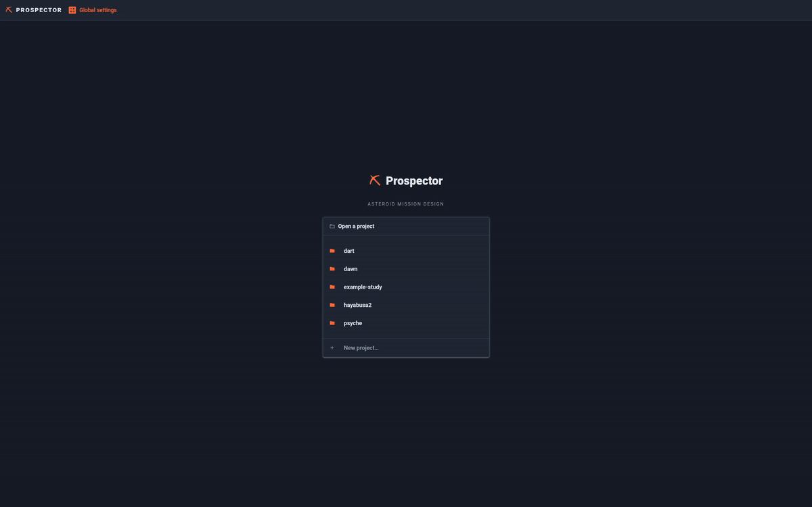
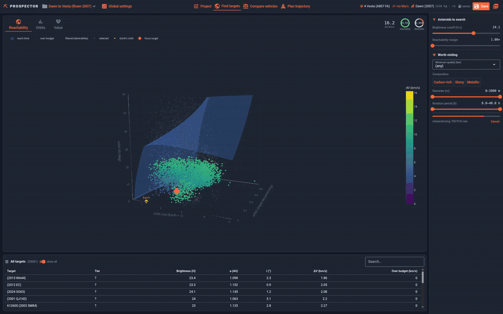
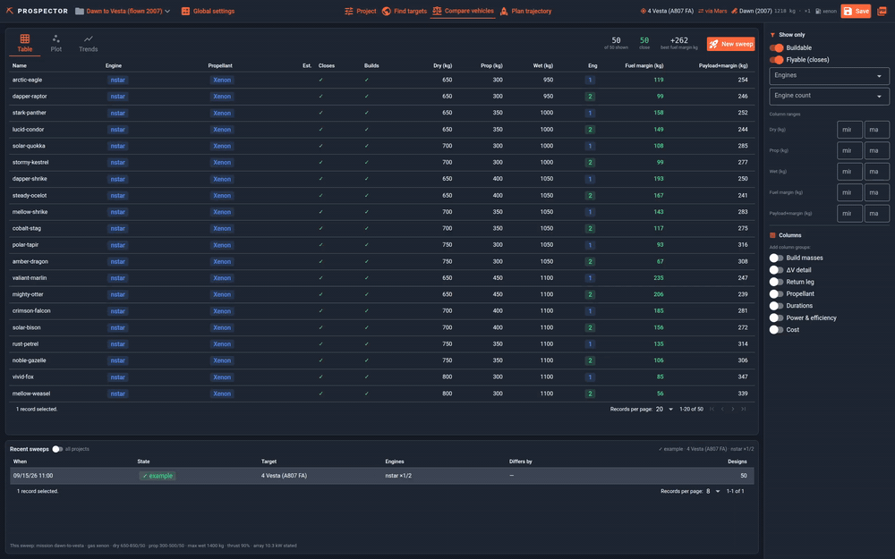
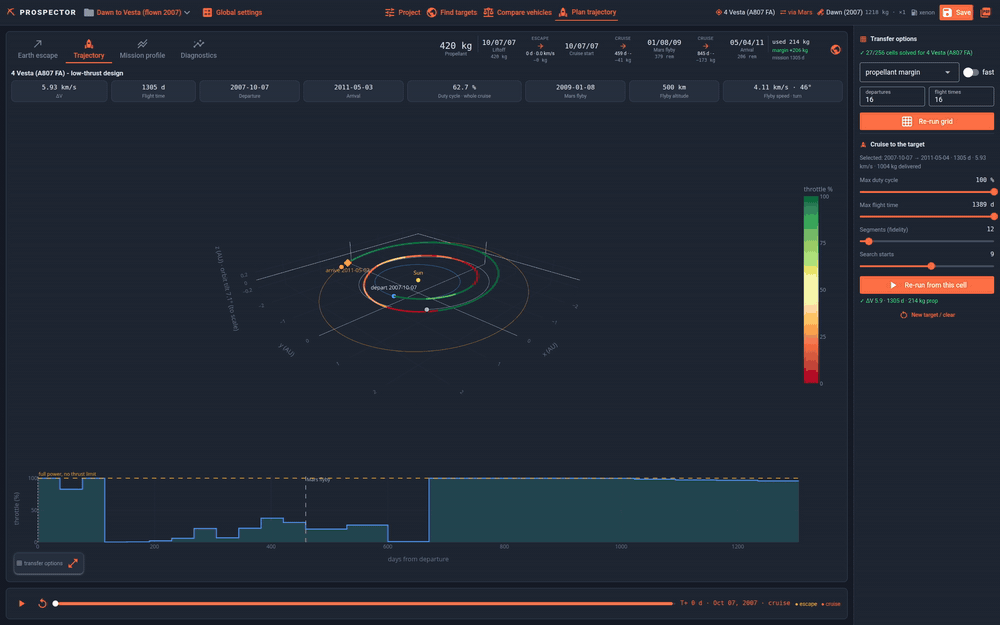

# prospector

Find which asteroids a low-thrust spacecraft can reach, and which of those are worth going to.

Give it a mission and a vehicle. It screens the small-body catalogue against that vehicle's
delta-v budget, describes what survives by what would make it worth mining, and hands the best
candidates to progressively more accurate trajectory solvers, ending at one you could fly. Every
step is visible in a desktop app.

It screens the catalogue in seconds from orbital elements alone, then narrows it by what a target
is made of, how big it is and how well it holds together. Escape and cruise are planned together,
since they trade against each other, and a mission can swing past a planet on the way, the two
legs solved as one. Vehicles can be compared across dry mass, propellant load,
engine count and working gas, and a study exports as a standalone PDF or a trajectory bundle for a
3D viewer.

The major planets are in the population too, so Mars is a reachable target like any other.
Arriving means matching its orbit, not capturing into one around it.

## What it looks like

Four workspaces, shown here on the Dawn example: set up the project, find targets, compare
vehicles, and plan the trajectory.



A project is a mission and a vehicle; everything else is derived.



The catalogue screened against the vehicle's budget, then narrowed by what a target is made of
and how big it is.



A sweep across dry mass, propellant and engine count, each design flown to the target.



A cruise picked off the transfer grid and flown through the Mars flyby, with the mission profile
and diagnostics behind it.

## Install

You need **git** and **pixi**. Everything else, Python, the solvers and the app, comes from
`pixi install`. Not pip or uv: the solvers are not on PyPI for macOS or Windows, see
[why pixi](#why-pixi-and-not-pip-or-uv).

Install pixi (once):

```bash
# macOS / Linux
curl -fsSL https://pixi.sh/install.sh | bash

# Windows (PowerShell)
iwr -useb https://pixi.sh/install.ps1 | iex
```

Reopen your terminal so `pixi` is on your `PATH`, then:

```bash
git clone https://github.com/karmanplus/prospector.git
cd prospector
pixi install
cp -r examples/configs configs
pixi run app
```

`pixi install` builds the locked environment; the first run downloads a few hundred megabytes. The
copy seeds your config library from the example set. On Windows PowerShell it is
`Copy-Item -Recurse examples/configs configs`. The block above has no trailing comments on purpose:
macOS's default zsh does not treat `#` as a comment on a pasted line, so a commented `cp` fails.

The first launch also downloads the small-body catalogue from JPL, which takes a minute or two and
is cached afterwards. The terminal says so while it runs.

## Your config library

Engines, launch types, propellants, missions, vehicles, studies and sizing coefficients live in
`configs/` as YAML, read at run time. Git does not track that directory; it is yours, and it never
travels back with the code. Skip the copy and the app says so and prints the command.

`examples/configs` is the template you copied from: four flown missions, Dawn, Psyche, Hayabusa2
and DART, with their real engines and masses from public sources, so you can check the tool
against history ([`docs/validation.md`](docs/validation.md)). Every file is annotated with what
its numbers mean and which are placeholders. Set `PROSPECTOR_CONFIG_DIR` to keep the library
elsewhere. The Dawn study also ships with a finished vehicle sweep (`examples/runs`), so Compare
vehicles has something to show before you have run one.

<details>
<summary><strong>Sharing a library with your team</strong></summary>

A config library is worth version-controlling, so make `configs/` its own repository, cloned into
place instead of copied:

```bash
git clone https://github.com/karmanplus/prospector.git
cd prospector
git clone <your-config-repo> configs
pixi install && pixi run app
```

Prospector gitignores `configs/`, so the two histories never touch. Not a submodule, deliberately:
a submodule records its URL and commit in the parent, which would put your library's location into
every copy of the tool you hand out.

</details>

## Running it

`pixi run app` opens a native desktop window on **Windows and macOS**. On **Linux** it opens a
browser tab at <http://localhost:8089>, since Linux has no reliable bundled webview.
`PROSPECTOR_UI=web` forces a tab anywhere; `PROSPECTOR_UI=native` forces the window. The app
listens on localhost only. There is no login, and it writes your config library and starts solver
processes, so set `PROSPECTOR_HOST=0.0.0.0` only if you mean to share it on your network.

> **Windows:** the native window needs the **Edge WebView2** runtime, which ships with Windows 11
> and current Windows 10. If no window appears, install it or use `PROSPECTOR_UI=web`.

### Target characterization (optional)

Working out which reachable targets are worth reaching queries public small-body catalogues and
needs a few extra dependencies, so it lives in its own environment:

```bash
pixi run -e enrichment app
```

Without it reachability and every solve are unaffected, and the panel says so. `pip install
space-classy` inside that environment adds the spectral hydration class. The first run caches a
large published dataset (~1.3 GB, the minimum-perihelion grid) under `data/`. Characterization
runs by itself for the 5,000 reachable targets nearest in ΔV, a button adds the next 5,000, and
every result is kept on disk, so nothing is looked up twice. Until a target is characterized it
is left out of the desirable list; a switch on the table shows those too.

### Figures in the exported PDF (optional)

Rendering the report's charts needs a headless browser, which pixi does not carry. Without one the
report still builds with every number in it and each chart replaced by a box naming the error.
Most machines already have Chrome or Chromium; otherwise `pixi run plotly_get_chrome` fetches one.

## Architecture

`prospector/` is a plain importable library. `ui/` (NiceGUI) and `worker.py` are shells over it,
and no physics is computed in them. Anything slow runs as a detached subprocess that writes a
status file the app polls, so there are no threads and no task queue.

The solvers run cheapest first, the cheap ones over the whole population and the expensive ones
only over what survives:

| | |
|---|---|
| `solvers/edelbaum` | Delta-v from orbital elements alone, with no dates and no positions. Screens the whole catalogue in numpy. |
| `solvers/lambert` | Two-body transfers between real dates. Every solve starts from one; never a low-thrust cost. |
| `solvers/simsflanagan` | The real low-thrust solve, seconds per run since PyKEP 3 supplied its own derivatives. |
| `trades/pipeline/grid` | That solve sampled over departure date and flight time. Every cell is a real trajectory, and this is the surface the app draws. |
| `solvers/spiral` | The Earth escape, flown properly. Prices the departure speed the cruise treats as free. |

The screening estimates undercharge delta-v on purpose, because the expensive mistake when
choosing targets is discarding one that was reachable, and none of them may reject a target by
itself. Past the screen the bias reverses: the escape flies worst-case radiation, thrust is derated
by the duty cycle, and the grid and the solve are ordinary optimizations. Read a screen number as a
floor and a converged one as an estimate. [`docs/physics.md`](docs/physics.md) has the measurements.

```
prospector/          the analysis library
  solvers/             the solvers, cheapest first
  spacecraft/          the bus: engines, propellants, arrays, radiation, buildability
  population/          where target bodies come from
  trades/              drivers over the solvers: one target, a sweep, a vehicle search
  enrichment/          what makes a target worth reaching
  figures/             the Plotly figures
  reporting/           the PDF
ui/                  the app
docs/physics.md      the modeling reference
examples/configs/    the config-library template
```

## Development

```bash
pixi run test     # pytest
pixi run lint     # ruff
pixi run check    # both
pixi shell        # drop into the environment to run tools directly
```

Tests mirror the source layout, so a module's tests are where its module is.

## Why pixi, and not pip or uv

`pyproject.toml` is the single source of dependency truth, but PyKEP is not installable from PyPI
on every platform this ships to. What PyPI carries is Linux-only with no source fallback, PyGMO is
in the same position, and building either needs heyoka, LLVM and Boost, so taking them from PyPI
would drop macOS and Windows. Pixi pulls both from conda-forge along with the compiled scientific
core, so every C extension shares one NumPy ABI, and installs the pure-Python layer from PyPI, in
one lockfile covering Linux, macOS and Windows.

PyKEP is pinned `>=3`, which reorganized the API this builds on and relicensed from GPL to MPL-2.0.

## Licence

[Apache-2.0](LICENSE). You can use this in a commercial or closed-source product and publish
nothing back. Carry the `LICENSE` and `NOTICE` files with what you take, note which files you
changed, and do not use the project's name to promote your own build. It also grants a patent
licence from the contributors, which MIT does not.

[CONTRIBUTING.md](CONTRIBUTING.md) covers how to send a change.
